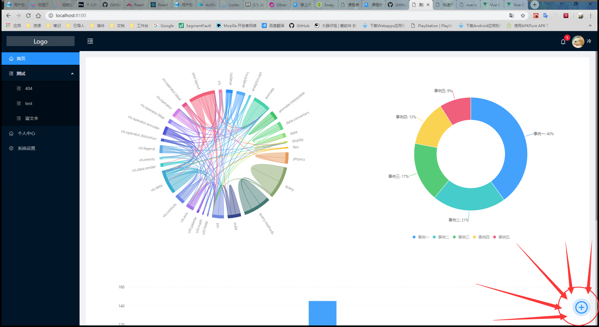
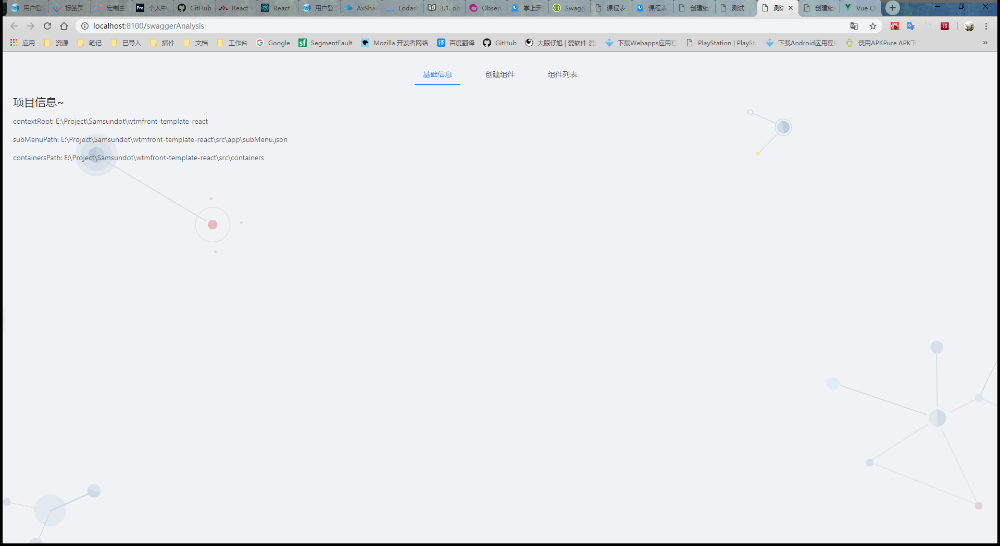
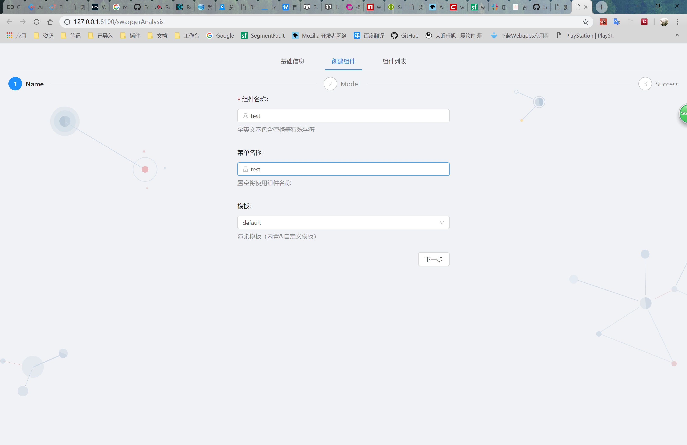
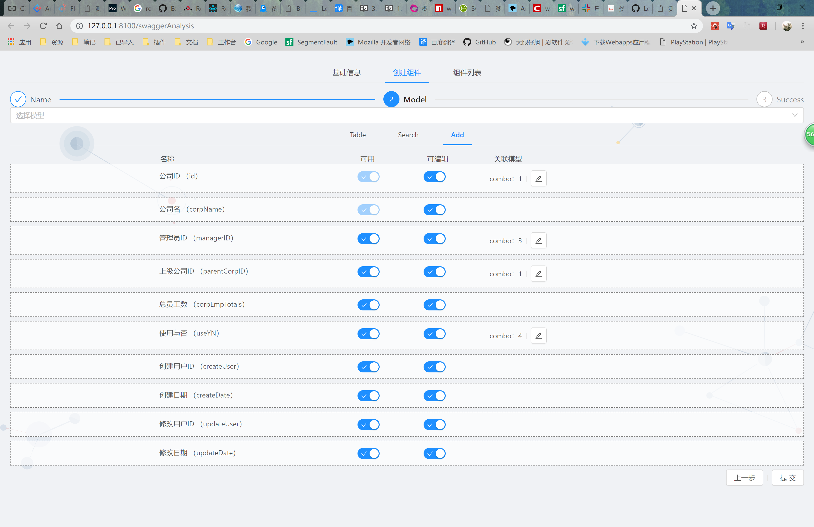
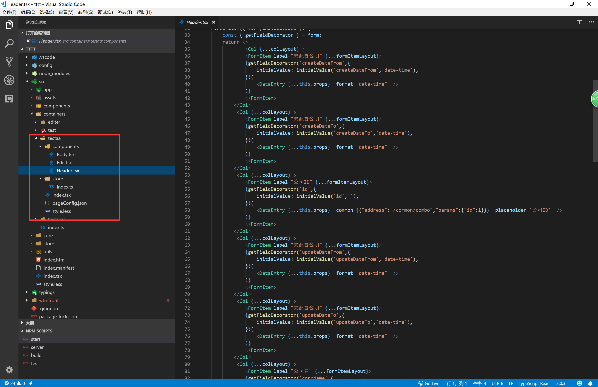
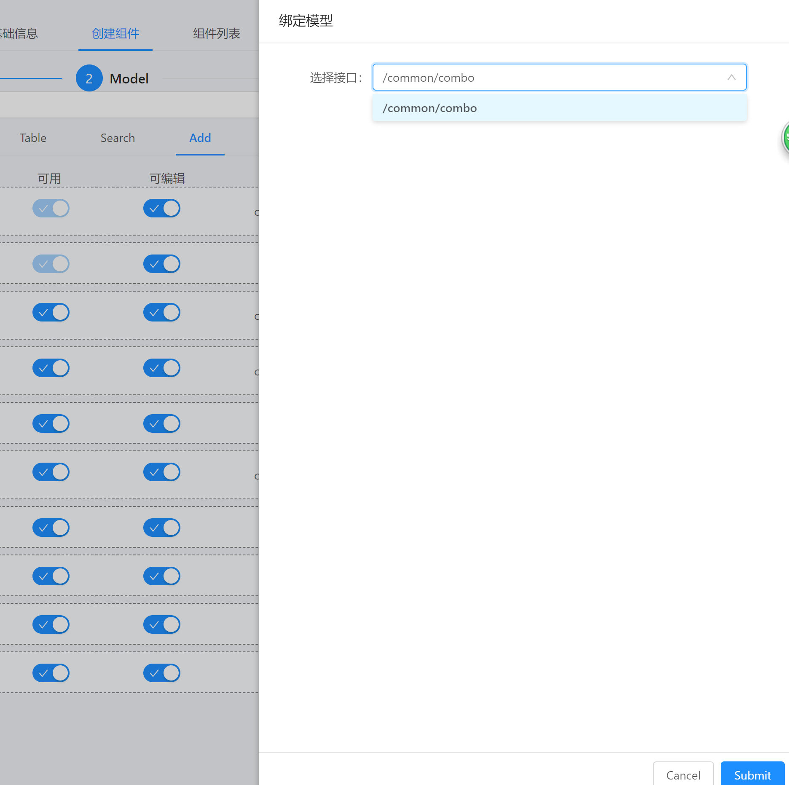

# 创建组件

## 入口
?> 需要开启 [模板服务](quickstart?id=启动模板服务) 或者 手动进入 /swaggerAnalysis 路由



## 界面

?>创建界面分为3个模块

>1：基础信息 （项目基础信息展示）<br>
>2：创建组件 （组件创建编辑）<br>
>3：组件列表 （已有组件列表，修改，删除）<br>




## 创建组件

?>组件的创建分为2个步骤。

>1：输入组件名称菜单信息选择模板<br>
>2：选择swagger模型编辑解析字段<br>
>3：提交数据到模板解析服务器<br>

### 1：输入组件名称菜单信息选择 [模板](temporary_edit?id=模板数据)

### 2：选择swagger模型编辑解析字段 （拖拽排序）

### 3：提交数据 (解析后的模板文件目录)
>点击提交。提示 组件创建成功。等待重新编译完成。页面中就能看到创建的组件。<br>
>创建完成的组件结构如下（根据模板生成）<br>
>pageConfig.json 为swagger 解析后的数据原型<br>



## 编辑字段 
?>table 表格显示
<br>search 表格搜索条件
<br>add 添加&编辑
<br>button 操作按钮 （可用：添加数据使用，可编辑：编辑数据使用（模板未启用） 关联模型 为 swagger 返回关联数据选项。 通过公共接口返回 ）



## 默认组件解析
### 目录介绍

!> [继承基类](class)
``` bash
    |-- components                                              
    |   |-- Body.tsx                                            数据表格 继承 tableBody
    |   |-- Edit.tsx                                            数据编辑组件 继承 tableEdit
    |   |-- Header.tsx                                          数据搜索组件 继承 tableHeader
    |-- store                                                   
    |   |-- index.ts                                            组件状态 继承 StoreBasice.ts
    |-- index.tsx                                               组件入口
    |-- pageConfig.json                                         解析后的swagger数据源文件
    |-- style.less                                              css
```